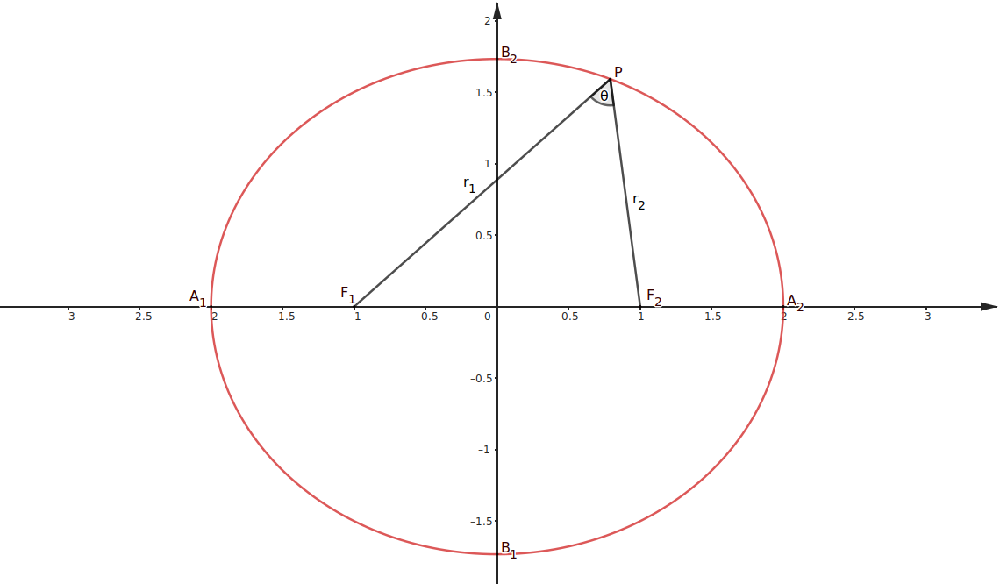
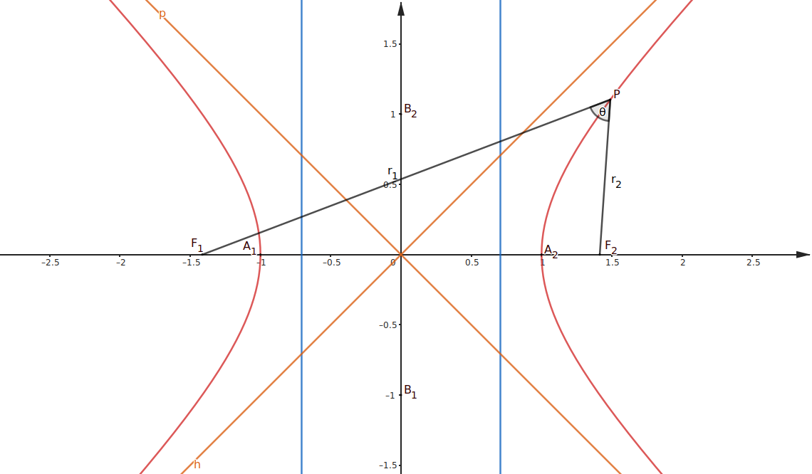

## 椭圆

默认 $A$ 为长轴顶点，$B$ 为短轴顶点，$F$ 为焦点，下标 $1$ 代表左或下，下标 $2$ 代表右或上，$P(x, y)$ 为椭圆上一点，$\theta = \angle F_1PF_2$。

### 定义

第一定义：$\left\{P(x, y) \mid |F_1P| + |F_2P| = 2a > |F_1F_2|\right\}$

第二定义：

- 焦点在 $x$ 轴上：$\left\{P(x, y) \mid |F_2P| = e \operatorname{dis}\left(P, x = \frac{a^2}{c}\right)\right\}$ 或 $\left\{P(x, y) \mid |F_1P| = e \operatorname{dis}\left(P, x = -\frac{a^2}{c}\right)\right\}$，其中 $x = \frac{a^2}{c}$ 和 $x = -\frac{a^2}{c}$ 是椭圆的准线
- 焦点在 $y$ 轴上：$\left\{P(x, y) \mid |F_2P| = e \operatorname{dis}\left(P, y = \frac{a^2}{c}\right)\right\}$ 或 $\left\{P(x, y) \mid |F_1P| = e \operatorname{dis}\left(P, y = -\frac{a^2}{c}\right)\right\}$，其中 $y = \frac{a^2}{c}$ 和 $y = -\frac{a^2}{c}$ 是椭圆的准线

第三定义：

- 焦点在 $x$ 轴上：$k_{A_1P}k_{A_2P} = -\frac{b^2}{a^2}$，其中 $A_1,A_2$ 为左右顶点
- 焦点在 $y$ 轴上：$k_{A_1P}k_{A_2P} = -\frac{a^2}{b^2}$，其中 $A_1,A_2$ 为上下顶点

### 离心率

$e$ 越大，椭圆越扁。

$e = \frac{c}{a} = \sqrt{1 - \frac{b^2}{a^2}} = \sin \angle OB_2F$

$\frac{b^2}{a^2} = 1 - e^2$

### 焦点三角形

$C_{\triangle F_1PF_2} = 2a + 2c$

$S_{\triangle F_1PF_2} = c|y_P| = b^2 \tan \frac{\theta}{2}$

当 $P$ 与 $B_1$ 或 $B_2$ 重合时，$\theta$ 最大，有 $S_{\triangle F_1PF_2 \max} = bc$。

### 焦点弦

$r_{1\max} = r_{2\max} = a + c$

$r_{1\min} = r_{2\min} = a - c$

焦点弦公式：

- 焦点在 $x$ 轴上：$r_1 = a + ex$，$r_2 = a - ex$
- 焦点在 $y$ 轴上：$r_1 = a + ey$，$r_2 = a - ey$

通径：$\frac{2b^2}{a}$

### 切线方程/切点弦方程

设切点/椭圆外一点为 $Q(x_0, y_0)$，切线斜率为 $k$。

切线方程/切点弦方程：

- 焦点在 $x$ 轴上：$\frac{x_0x}{a^2} + \frac{y_0y}{b^2} = 1$，$k_{OQ}k = -\frac{b^2}{a^2}$
- 焦点在 $y$ 轴上：$\frac{y_0y}{a^2} + \frac{x_0x}{b^2} = 1$，$k_{OQ}k = -\frac{a^2}{b^2}$

### 参数方程

- 焦点在 $x$ 轴上：$\begin{cases} x = a\cos \theta\\ y = b\sin\theta\\ \end{cases}$
- 焦点在 $y$ 轴上：$\begin{cases} x = b\cos \theta\\ y = a\sin\theta\\ \end{cases}$

### 中点弦
设 $Q$ 为弦 $MN$ 中点，则有：

- 焦点在 $x$ 轴上：$k_{OQ}k_{MN} = -\frac{b^2}{a^2}$
- 焦点在 $y$ 轴上：$k_{OQ}k_{MN} = -\frac{a^2}{b^2}$

### 定值关系

中点弦斜率也是一种定值关系。

设 $M,N$ 为椭圆上关于原点对称的两个点，则有：

- 焦点在 $x$ 轴上：$k_{MP}k_{NP} = -\frac{b^2}{a^2}$
- 焦点在 $y$ 轴上：$k_{MP}k_{NP} = -\frac{a^2}{b^2}$

## 双曲线

默认 $A$ 为实轴顶点，$B$ 为虚轴顶点，$F$ 为焦点，下标 $1$ 代表左或下，下标 $2$ 代表右或上，$P(x, y)$ 双曲线上一点，$\theta = \angle F_1PF_2$。

### 定义

第一定义：$\left\{P(x, y) \mid ||F_1P| - |F_2P|| = 2a < |F_1F_2|\right\}$

第二定义：

- 焦点在 $x$ 轴上：$\left\{P(x, y) \mid |F_2P| = e \operatorname{dis}\left(P, x = \frac{a^2}{c}\right)\right\}$ 或 $\left\{P(x, y) \mid |F_1P| = e \operatorname{dis}\left(P, x = -\frac{a^2}{c}\right)\right\}$，其中 $x = \frac{a^2}{c}$ 和 $x = -\frac{a^2}{c}$ 是双曲线的准线
- 焦点在 $y$ 轴上：$\left\{P(x, y) \mid |F_2P| = e \operatorname{dis}\left(P, y = \frac{a^2}{c}\right)\right\}$ 或 $\left\{P(x, y) \mid |F_1P| = e \operatorname{dis}\left(P, y = -\frac{a^2}{c}\right)\right\}$，其中 $y = \frac{a^2}{c}$ 和 $y = -\frac{a^2}{c}$ 是双曲线的准线

第三定义：

- 焦点在 $x$ 轴上：$k_{A_1P}k_{A_2P} = \frac{b^2}{a^2}$，其中 $A_1,A_2$ 为左右顶点
- 焦点在 $y$ 轴上：$k_{A_1P}k_{A_2P} = \frac{a^2}{b^2}$，其中 $A_1,A_2$ 为上下顶点

### 离心率

$e = \frac{c}{a} = \sqrt{1 + \frac{b^2}{a^2}} = \frac{|F_1F_2|}{||PF_1| - |PF_2||} = \frac{\sin \theta}{|\sin\angle PF_1F_2 - \sin\angle PF_2F_1|}$

$\frac{b^2}{a^2} = e^2 - 1$

若 $e_1, e_2$ 为两条共轭双曲线的离心率，则 $\frac{1}{e_1^2} + \frac{1}{e_2^2} = 1$

### 渐近线

- 焦点在 $x$ 轴上：$y = \pm \frac{b}{a}x = \pm\sqrt{e^2 - 1}x$
- 焦点在 $y$ 轴上：$y = \pm \frac{a}{b}x = \pm\sqrt{\frac{1}{e^2 - 1}}x$

已知渐近线方程为 $y = \frac{b}{a}x$，则可设双曲线方程为 $\frac{x^2}{a^2} - \frac{y^2}{b^2} = \lambda\ (\lambda \ne 0)$。

过焦点做渐近线的垂线段，垂线段长度即焦点到渐近线距离为 $b$，垂足与原点连线长度为 $a$。

### 焦点三角形
$S_{\triangle F_1PF_2} = c|y_P| = \frac{b^2}{\tan \frac{\theta}{2}}$

### 焦点弦

- 点与焦点在同侧：$r_{1\min} = r_{2\min} = c - a$
- 点与焦点在异侧侧：$r_{1\min} = r_{2\min} = c + a$

焦点弦公式：

- 焦点在 $x$ 轴上：$r_1 = |a + ex|$，$r_2 = |a - ex|$
- 焦点在 $y$ 轴上：$r_1 = |a + ey|$，$r_2 = |a - ey|$

通径：$\frac{2b^2}{a}$

### 切线方程/切点弦方程

设切点/椭圆外一点为 $Q(x_0, y_0)$，切线斜率为 $k$。

切线方程/切点弦方程：

- 焦点在 $x$ 轴上：$\frac{x_0x}{a^2} - \frac{y_0y}{b^2} = 1$，$k_{OQ}k = \frac{b^2}{a^2}$
- 焦点在 $y$ 轴上：$\frac{y_0y}{a^2} - \frac{x_0x}{b^2} = 1$，$k_{OQ}k = \frac{a^2}{b^2}$

### 参数方程

形式 1：

- 焦点在 $x$ 轴上：$\begin{cases} x = a\sec \theta = \frac{a}{\cos \theta}\\ y = b\tan\theta\\ \end{cases}$
- 焦点在 $y$ 轴上：$\begin{cases} x = b\tan \theta\\ y = a\sec \theta = \frac{a}{\cos \theta}\\ \end{cases}$

形式 2：

- 焦点在 $x$ 轴上：$\begin{cases} x = a\cosh \theta = \frac{a(e^x + e^{-x})}{2}\\ y = b\sinh\theta = \frac{b(e^x - e^{-x})}{2}\\ \end{cases}$
- 焦点在 $y$ 轴上：$\begin{cases} x = b\sinh \theta = \frac{b(e^x - e^{-x})}{2}\\ y = a\cosh \theta = \frac{a(e^x + e^{-x})}{2}\\ \end{cases}$

## 抛物线